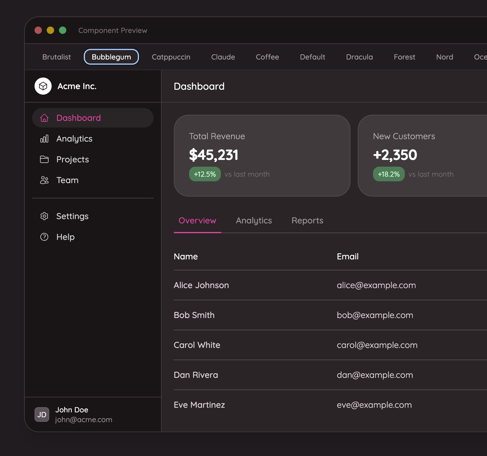

<p align="center">
  <picture>
    <source media="(prefers-color-scheme: dark)" srcset="https://github.com/user-attachments/assets/7f3c77b9-e549-4887-872e-a0d512678945">
    <source media="(prefers-color-scheme: light)" srcset="https://github.com/user-attachments/assets/8cf172b8-0e36-47c4-b096-a6fad0044e32">
    
  </picture>
</p>

> [!IMPORTANT]
> This is an opinionated starter kit created by me (Josh Cirre) using Laravel Livewire and Livewire Flux. While PRs are welcome, this is designed to fit the needs of one person.

> [!TIP]
> Clone the repository and run `composer setup` to get started quickly. See [Installation](#installation) below.

## TweakFlux — Deep Theming for Flux UI

Fission pairs well with [**TweakFlux**](https://github.com/joshcirre/tweakflux), a theming package that lets you transform every Flux component with a single command. Override Tailwind v4 CSS custom properties to apply 20+ preset themes or generate your own — zero vendor files touched.

```bash
composer global require joshcirre/tweakflux
tweakflux apply bubblegum
```

<p align="center">
  
</p>

## Why Does This Exist?

Up until Livewire Flux released, I used Breeze as a starting point for 99% of new projects that I would create. Typically, those new projects were built for demos on videos or starting points for tutorials. In addition, I would start side projects or app ideas with Breeze, as well.

Eventually I knew I wanted to create my own starting kit that worked well for what I needed in most scenarios. Authentication and a dashboard where I can start writing code.

Once Livewire Flux released, it was the perfect time to make this happen.

## Flux

Fission uses [Livewire Flux](https://fluxui.dev) (free) for its UI components. No Flux Pro license is required out of the box.

If you want access to premium components (date pickers, calendars, charts, tabs, and more), you can install Flux Pro during setup when prompted for optional packages. Fission does not include any of Flux's CSS or built assets — you must have the package installed to use it.

## Installation

### Quick Start (Recommended)

```bash
git clone https://github.com/joshcirre/fission.git my-project
cd my-project
composer setup
```

### Using Composer Create-Project

```bash
composer create-project joshcirre/fission my-project
cd my-project
composer setup
```

> [!NOTE]
> The `laravel new --using` flag is not recommended due to archive extraction issues with special characters in filenames.

The `composer setup` command handles:

- Dependency installation
- Environment configuration (.env)
- Application key generation
- SQLite database creation
- Optional packages (Flux Pro, Filament, Bento, etc.)
- Optional teams scaffolding (defaults to no during install)
- Database migrations
- Project name configuration
- NPM dependency installation
- Asset building

During installation, Fission will ask whether you want full teams support.

- Choose `yes` to keep team creation, switching, invitations, and member role management.
- Choose `no` to remove the team-specific backend, routes, views, and tests before setup finishes.

### Working With Teams

When teams are enabled, Fission follows the starter-kit pattern for team-aware features:

- Store the active team on the user via `current_team_id` and switch context from the team switcher UI.
- Put team-owned features under a team URL when the page itself is team-specific, for example `/{team}/playground`.
- Model team-owned records with a `team_id` foreign key and query through the bound team, not globally.
- Authorize access through team membership or team policies, for example `->can('view', 'team')` on routes.
- Keep generic account pages like `/profile` unscoped unless the page is explicitly about a team.

## Development

```bash
composer dev          # Start server, queue, logs, and Vite
```

### Code Quality

Fission enforces strict code quality through automated tooling:

```bash
composer fix          # Fix everything: types, refactoring, formatting
composer test         # Run all checks: tests, linting, types, refactoring
```

| Command             | Purpose                                              |
| ------------------- | ---------------------------------------------------- |
| `composer fix`      | PHPStan → Rector → Prettier → Pint                   |
| `composer test`     | Typos → Pest → Lint check → PHPStan → Rector dry-run |
| `composer lint`     | Pint + Prettier (quick format)                       |
| `composer refactor` | Rector only                                          |

### Individual Test Commands

```bash
composer test:unit          # Pest tests (parallel)
composer test:unit:coverage # Pest with coverage
composer test:types         # PHPStan analysis
composer test:lint          # Check formatting (no fix)
composer test:refactor      # Rector dry-run
composer test:typos         # Peck typo checker
```

### Tooling Stack

- **[Pest](https://pestphp.com)** - Testing framework
- **[PHPStan](https://phpstan.org)** + Larastan - Static analysis (max level)
- **[Rector](https://getrector.com)** - Automated refactoring
- **[Pint](https://laravel.com/docs/pint)** - PHP code style (strict Laravel)
- **[Prettier](https://prettier.io)** - JS/CSS formatting
- **[Peck](https://github.com/peckphp/peck)** - Typo detection

## Recommended AI Skills

If you use [AI coding assistants](https://skills.sh) with this project, these skills provide useful context for the stack:

| Skill | Install |
|-------|---------|
| **Flux UI Development** — Flux UI component usage, variants, and patterns | `npx skills add laravel/boost --skill fluxui-development` |
| **Livewire Development** — Livewire 4 component patterns, directives, islands, and testing | `npx skills add spatie/freek.dev@livewire-development` |
| **TweakFlux Theme Generator** — Generate custom Flux UI themes from descriptions or palettes | `tweakflux boost` (requires [joshcirre/tweakflux](https://github.com/joshcirre/tweakflux)) |
| **Playwriter** — Control your actual Chrome browser from AI agents (requires [Chrome extension](https://playwriter.dev)) | Included in `.agents/skills/` · CLI: `npm i -g playwriter` |
| **Expect CLI** — Adversarial browser testing for code changes (requires `npm i -g expect-cli`) | Included in `.agents/skills/` · Init: `npx -y expect-cli@latest init` |

## License

The Fission starter kit is open-sourced software licensed under the [MIT license](https://opensource.org/licenses/MIT).
